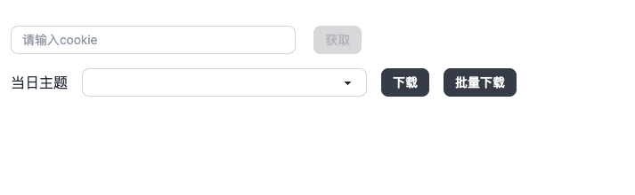
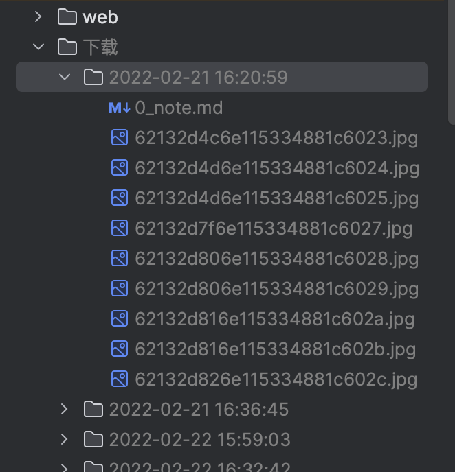

# python and svelte project

一个从第三方服务获取特定图片并批量下载的工具

### 项目介绍

家里小朋友在托班，每天老师会在放学后会上传一份当天的记录，包含很多图片和几条文字介绍。
由于手机上看实在是慢，而且保存到本地也方便今后查看，所以就想着写个工具，批量下载当天的图片，保存到本地。

### 使用说明
1. 从对应服务处获取 cookie ，补充进前端页面内，之后调用 api 获取数据
2. 选中对应日期，批量下载当天图片，保存到"下载"文件夹中。(也可以通过"批量下载"下载本次获取时间段的全部数据)
3. 提取老师当天的反馈信息，如果有多个，使用 markdown 分隔符分割，保存到当天文件夹中，命名为"0.md"

### 项目启动
1. `make build` 将 web 服务打包到 python 服务的 templates 文件夹中
2. `make run` 启动 python 服务
3. 访问 http://localhost 即可

### 项目截图

#### 前端页面

#### 下载文件结构

